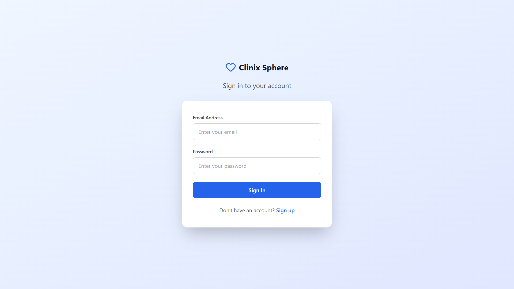
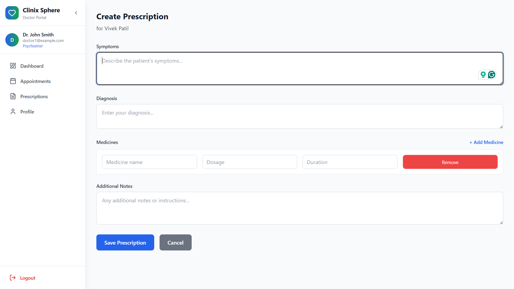
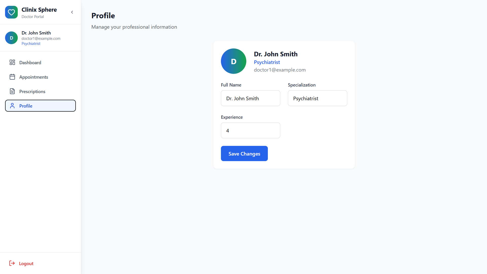
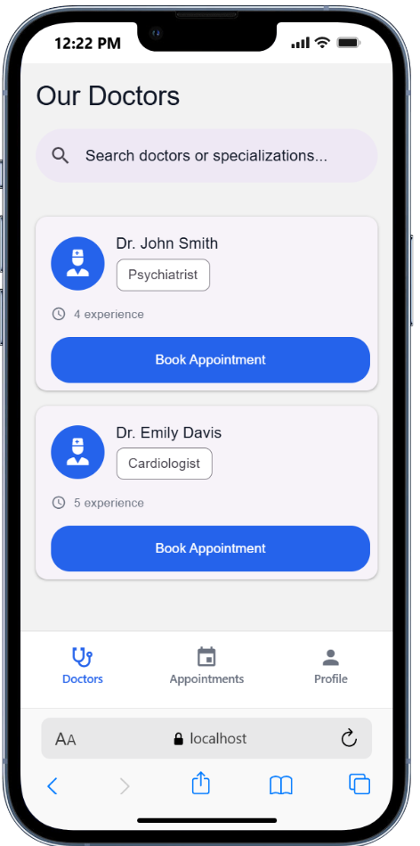
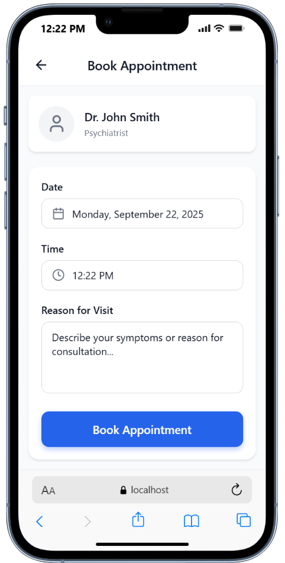
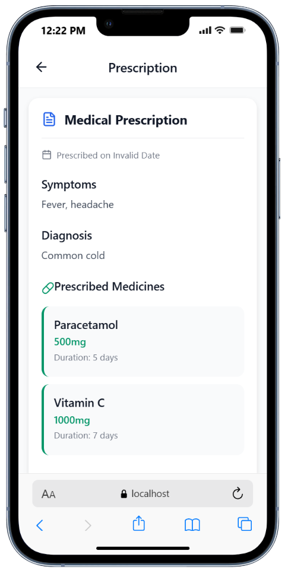
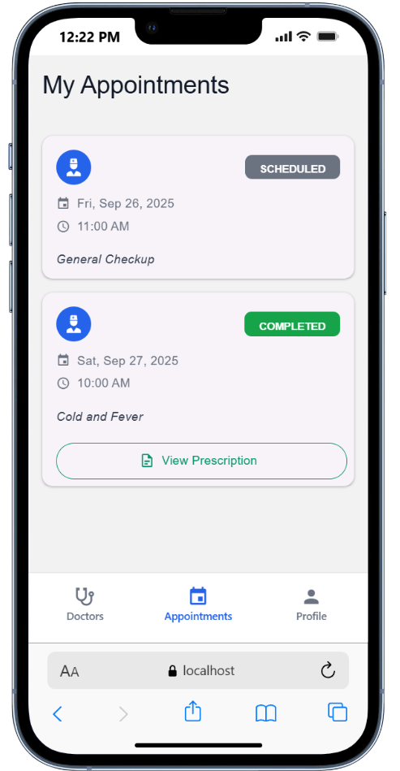
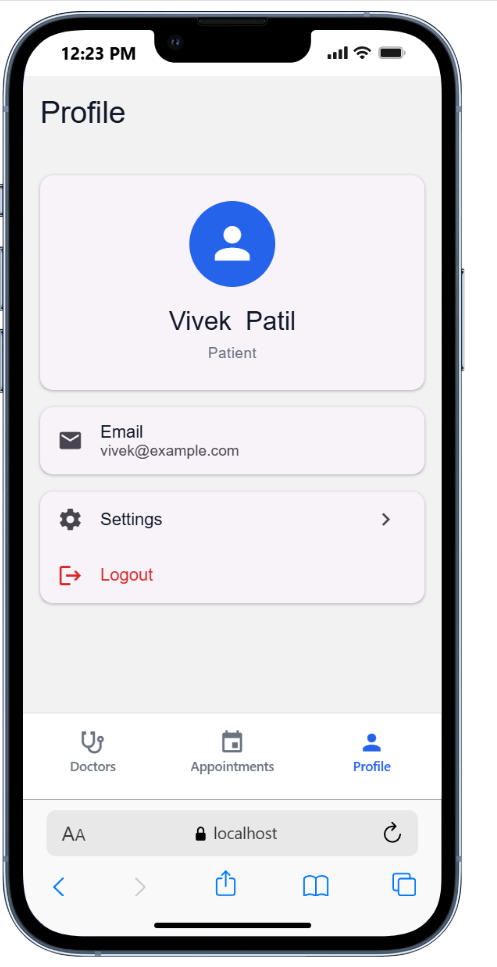

# 📌 Doctor-Patient System

## 📖 Description

A full-stack healthcare management system with a **Doctor Dashboard (Web App)**, **Patient App (Mobile)**, and a **Backend API Server**. It helps patients book appointments, doctors manage schedules, and provides prescription tracking.

---

## 📂 Project Structure

```
doctor-patient-system/
│── doctor-dashboard/   # ReactJS web app for doctors
│── patient-app/        # React Native (Expo) mobile app for patients
│── backend/            # ExpressJS + MongoDB API server
```

---

## 🛠 Tech Stack

* **Frontend (Doctor Dashboard):** ReactJS + Vite + TailwindCSS
* **Mobile (Patient App):** React Native (Expo), Zustand Store
* **Backend:** ExpressJS, MongoDB, Mongoose, JWT Auth, CORS
* **Deployment:** Render (Backend), Vercel (Doctor Dashboard), Expo.dev (Patient App)

---

## ⚙️ .env File Structure

### Backend (.env)

```env
PORT=5000
MONGO_URI=your_mongodb_connection_string
JWT_SECRET=your_secret_key
```

### Doctor Dashboard (.env)

```env
VITE_API_BASE_URL=http://localhost:5000/api
```

### Patient App (app.config.ts)

```ts
extra: {
  API_BASE_URL: process.env.API_BASE_URL || "http://localhost:5000/api"
}
```

---

## 🌐 API Endpoints

### 🔑 Authentication (`/api/auth`)

* **POST** `/register` → Register a new patient/doctor
* **POST** `/login` → Login and receive JWT

---

### 🧑‍⚕️ Doctors (`/api/doctors`)

* **GET** `/` → Get all doctors
* **GET** `/:id` → Get doctor by ID
* **PUT** `/` (Protected) → Update doctor profile

---

### 📅 Appointments (`/api/appointments`)

* **POST** `/` (Protected) → Create an appointment
* **GET** `/` (Protected) → Get all appointments for logged-in user/doctor
* **PATCH** `/:id/status` (Protected) → Update appointment status (approve/reject/complete)

---

### 💊 Prescriptions (`/api/prescriptions`)

* **POST** `/` (Protected) → Create a prescription
* **GET** `/` (Protected) → Get all prescriptions
* **GET** `/:appointmentId` (Protected) → Get prescription by appointment ID

---

### 🏥 Health Check

* **GET** `/api/health` → API health status
* **GET** `/` → Root endpoint with API status

---

## 📝 Demo Login Credentials

### Patient

* **Email:** [vivek@example.com](mailto:vivek@example.com)
* **Password:** 123456

### Doctors

* **Doctor 1:** [doctor1@example.com](mailto:doctor1@example.com) / 123456
* **Doctor 2:** [doctor2@example.com](mailto:doctor2@example.com) / 123456

---

## 📷 Screenshots

### 🧑‍⚕️ Doctor Dashboard

<div align="center">

<table>
  <tr>
    <td align="center">Login / Register</td>
    <td align="center">Dashboard with Appointments</td>
    <td align="center">Create Prescription</td>
  </tr>
  <tr>
    <td></td>
    <td></td>
    <td></td>
  </tr>
  <tr>
    <td align="center">Appointments</td>
    <td align="center">Doctor Profile</td>
    <td align="center"></td>
  </tr>
  <tr>
    <td></td>
    <td></td>
    <td></td>
  </tr>
</table>

</div>

---

### 📱 Patient App

<div align="center">

<table>
  <tr>
    <td align="center">Login / Register</td>
    <td align="center">Doctors List</td>
    <td align="center">Appointment Booking</td>
  </tr>
  <tr>
    <td></td>
    <td></td>
    <td></td>
  </tr>
  <tr>
    <td align="center">Prescriptions</td>
    <td align="center">My Appointments</td>
    <td align="center">Patient Profile</td>
  </tr>
  <tr>
    <td></td>
    <td></td>
    <td></td>
  </tr>
</table>

</div>

---

## 🚀 Getting Started

### 1️⃣ Clone the repository

```bash
git clone https://github.com/vivekPatil45/doctor-patient-system.git
cd doctor-patient-system
```

### 2️⃣ Setup Backend

```bash
cd backend
npm install
npm run dev
```

### 3️⃣ Setup Frontend (Doctor Dashboard)

```bash
cd doctor-dashboard
npm install
npm run dev
```

### 4️⃣ Setup Patient App (Expo)

```bash
cd patient-app
npm install
npx expo start
```

### 5️⃣ Open in Browser / Mobile

* **Doctor Dashboard:** [https://doctor-dashboard-vivek.vercel.app](https://doctor-dashboard-vivek.vercel.app)
* **Patient App:** [https://expo.dev/@vivekpatil45/patient-app](https://expo.dev/@vivekpatil45/patient-app)

---

## ✨ Features

* Patient Registration & Login
* Browse Doctors & Book Appointments
* Doctor Dashboard for Appointments
* Prescription Management
* JWT-based Authentication

---

## 👨‍💻 Author

✨ Developed with passion by **Vivek Patil** 🚀

* 🔗 **Portfolio:** [vivek45.vercel.app](https://vivek45.vercel.app/)
* 💻 **GitHub:** [github.com/vivekPatil45](https://github.com/vivekPatil45)
* 🌐 **LinkedIn:** [Vivek Patil](https://www.linkedin.com/in/vivek-patil-76a)
